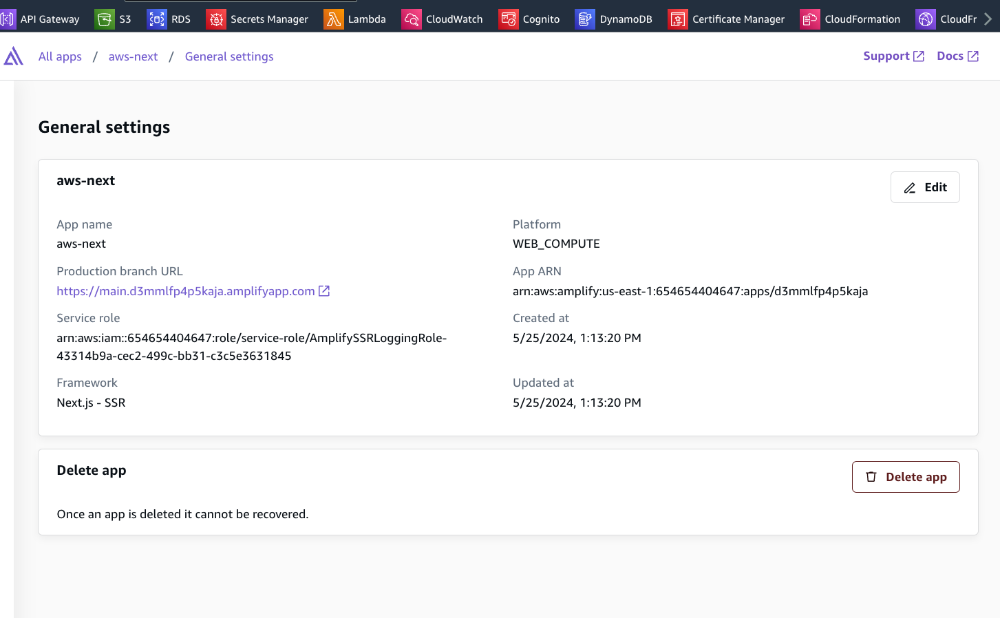
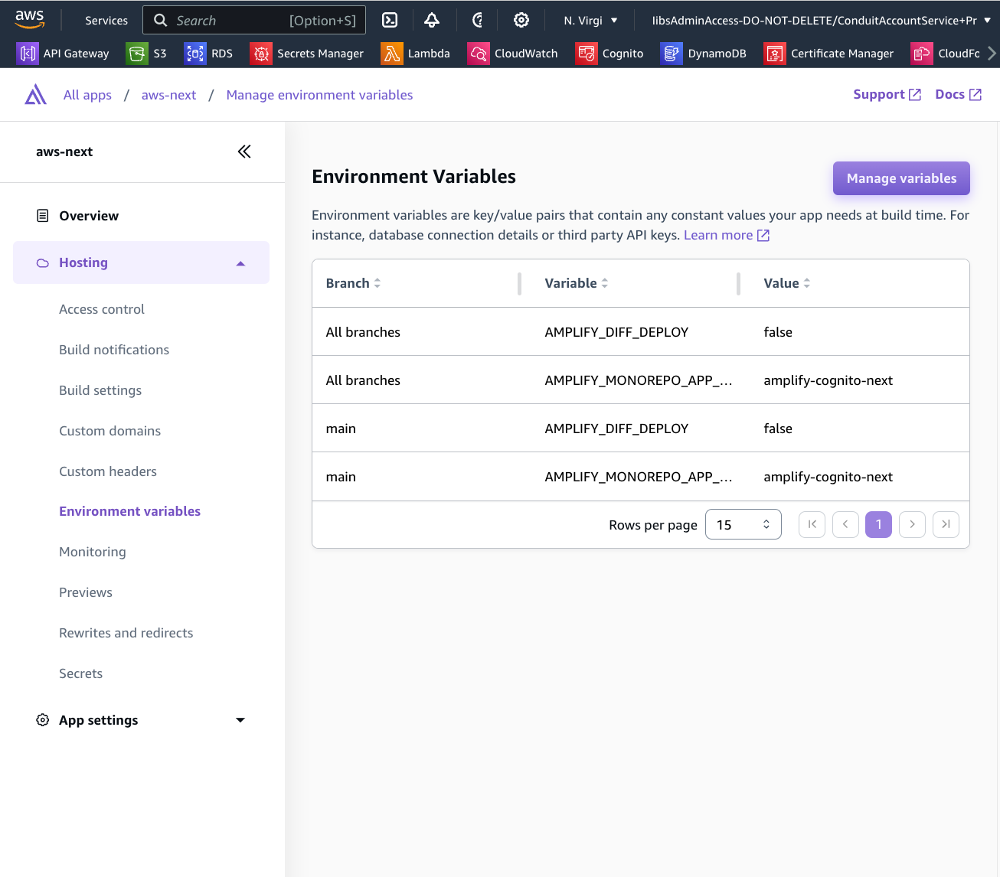

# Amplify NextJs

- This framework use Amplify Hosting Service, which are basically Cloudfront Lambda Edge for optimizing performance of NextJs Server-side apps
- This template utilize `aws-amplify/auth` dependencies on client-side:

```
import {
  signUp,
  confirmSignUp,
  signIn,
  signOut,
  resendSignUpCode,
  autoSignIn,
  updateUserAttribute,
  type UpdateUserAttributeOutput,
  confirmUserAttribute,
  updatePassword,
} from "aws-amplify/auth";
```

- This template does not use default components from Amplify React UI, but customized upon `aws-amplify/auth` from client-side and `aws-amplify/auth/server` from server-side for authenticating request context:

```
  //Server-side authentication and authorization from Next `middleware.ts`
  export async function authenticatedUser(context: NextServer.Context) {
    return await runWithAmplifyServerContext({
      nextServerContext: context,
      operation: async (contextSpec) => {
        try {
          const session = await fetchAuthSession(contextSpec);
          if (!session.tokens) {
            return;
          }
          const user = {
            ...(await getCurrentUser(contextSpec)),
            isAdmin: false,
          };
          const groups = session.tokens.accessToken.payload["cognito:groups"];
          // @ts-ignore
          user.isAdmin = Boolean(groups && groups.includes("Admins"));

          return user;
        } catch (error) {
          console.log(error);
        }
      },
    });
  }
```

## Documentation:

- Official [Amplify Github template](https://github.com/aws-samples/amplify-next-template) for NextJs
- [Amplify deployment instructions](https://docs.amplify.aws/nextjs/start/quickstart/nextjs-app-router-client-components/#deploy-a-fullstack-app-to-aws)
- Tutorial: https://www.youtube.com/watch?v=tHYVP5zgpac&list=PLug_z34YaEYsXkD2Z-6FpiziKXv04NCjw&index=5

## Amplify steps:

- Optionally, we can use `amplify.yml` directly from root repo, not inside this mono-repo folder

## Adding IAM policies for Amplify Computing roles



