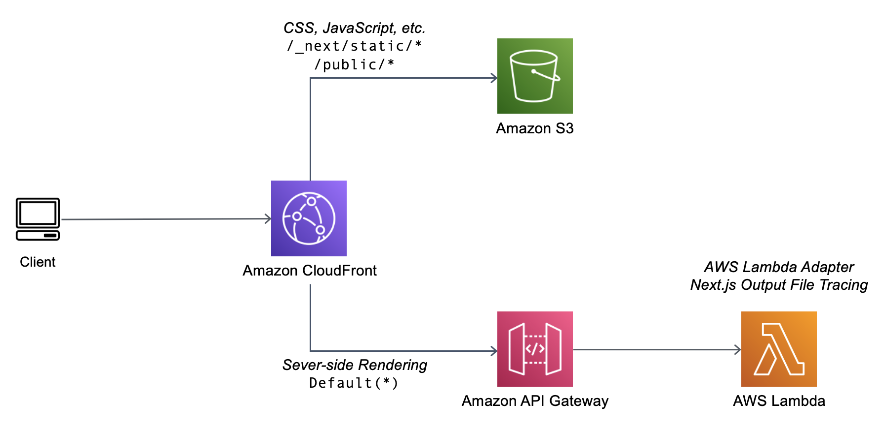

# Important

- `next.config.mjs` must have output set to standalone:

```
const nextConfig = {
  reactStrictMode: true,
  output: "standalone",
};
```

- Postbuild script needs to be present in app/package.json

```
    "postbuild": "echo \"#!/bin/bash\n\nnode server.js\" > .next/standalone/run.sh",
```

- All public assets must be under `static` folder to be mapped correctly by CloudFront

## Solution Architecture



## Requirements

- Node.js 16.x
- [AWS Lambda Web Adapter](https://github.com/awslabs/aws-lambda-web-adapter)
- AWS CDK 2.30.x
- AWS SAM CLI 1.53.x
- Configured AWS credentials

## This was forked and extended to both app-router and page-router NextJS. [Official aws samples repo](https://github.com/aws-samples/aws-lambda-nextjs) is available.
