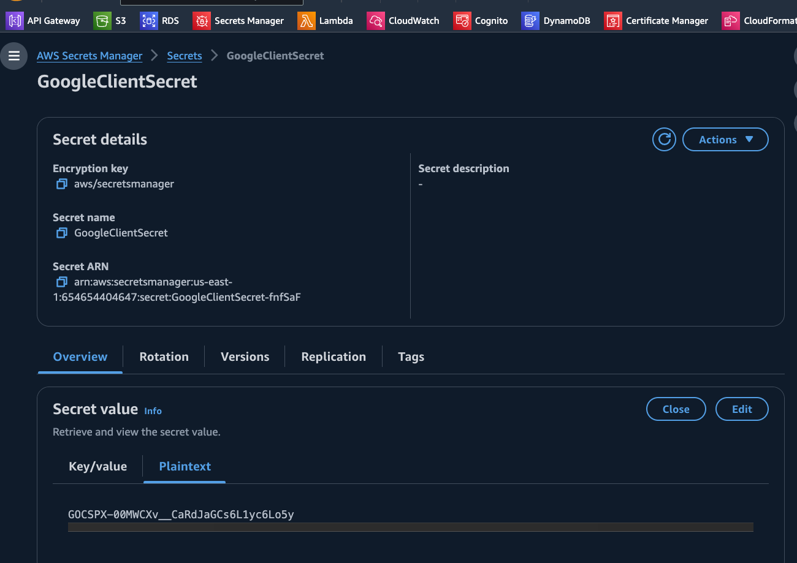
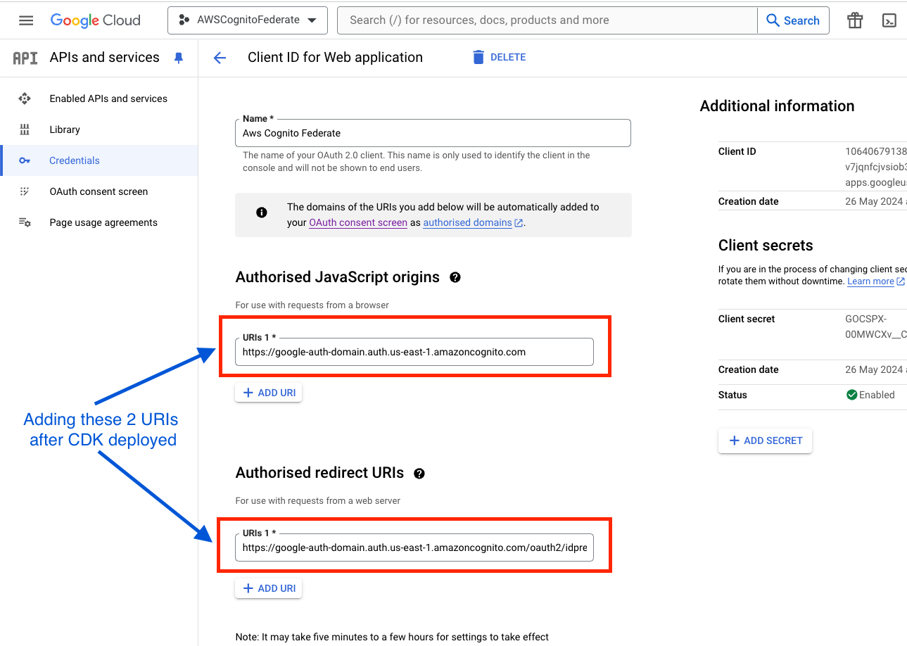

# Setting up Cognito user pool with CDK, to be used in NextJs app

## References:

- [Main Tutorial](https://www.youtube.com/watch?v=Wi3CEhPEEuw)
- https://aws-cdk.com/cognito-google
- https://github.com/focusOtter/fullstack-google-auth-flow-cdk
- https://www.youtube.com/watch?v=r1P_glQGvfo&t=69s

## Deployment

- Create a project with Google Dev Console, consent OAuth screen with ['openId', 'email', 'username'] scopes
- Set up a `plain text` Secret Manager entry with exact name in CDK, under `clientSecret`, to keep GoogleClientSecret
  

- After deploying the CDK, we will receive the stack output, where we can find `AuthorizedRedirectUserPoolDomainURL` and `GoogleUserPoolDomainUrl`:

```
cdk-helper.AuthorizedRedirectUserPoolDomainURL = https://google-auth-domain.auth.us-east-1.amazoncognito.com/oauth2/idpresponse
cdk-helper.GoogleUserPoolDomainUrl = https://google-auth-domain.auth.us-east-1.amazoncognito.com
```

- Go back to Google Dev Console, and fill these 2 URIs follow this below picture:
  

## Useful commands

- `npm run build` compile typescript to js
- `npm run watch` watch for changes and compile
- `npm run test` perform the jest unit tests
- `cdk deploy` deploy this stack to your default AWS account/region
- `cdk diff` compare deployed stack with current state
- `cdk synth` emits the synthesized CloudFormation template
